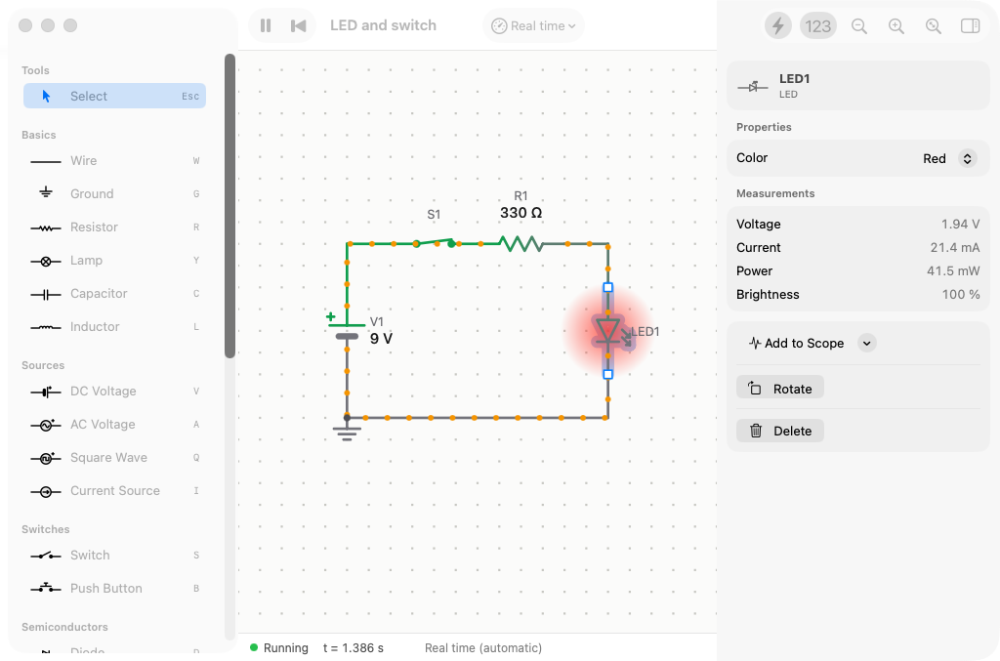
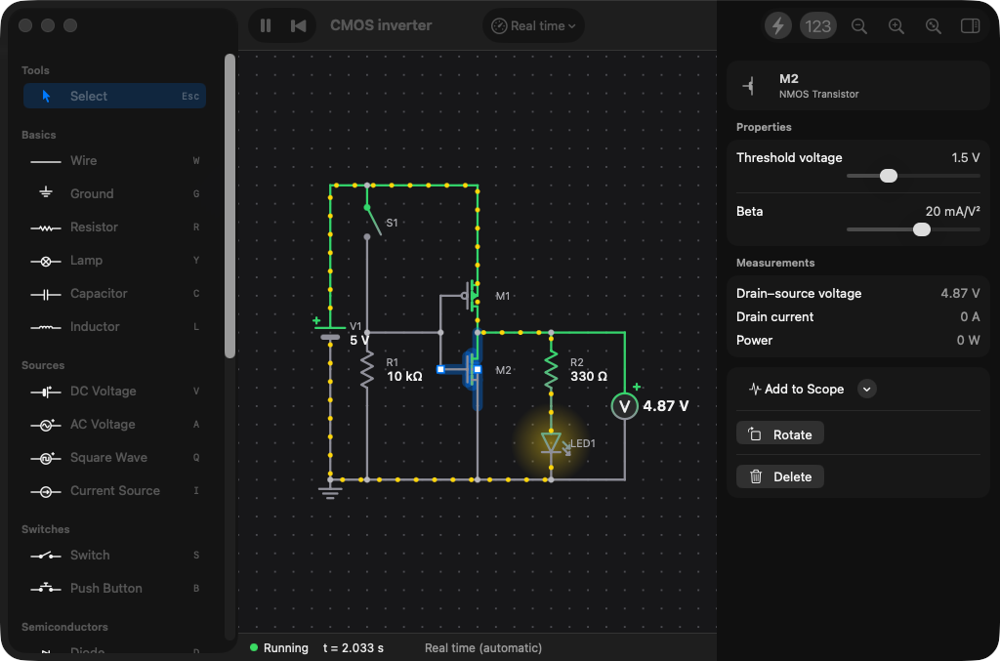
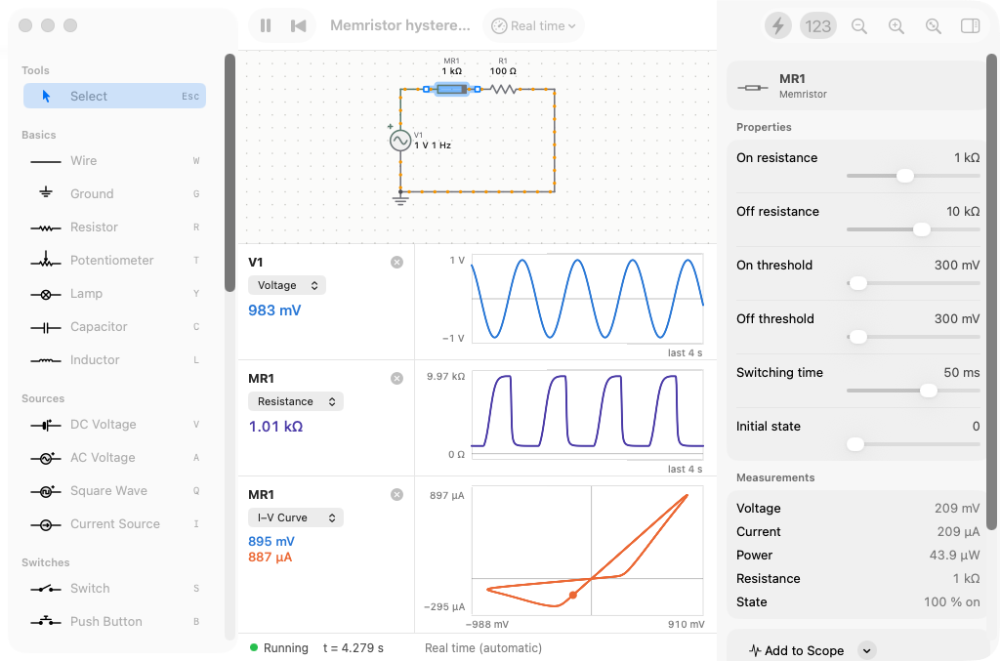
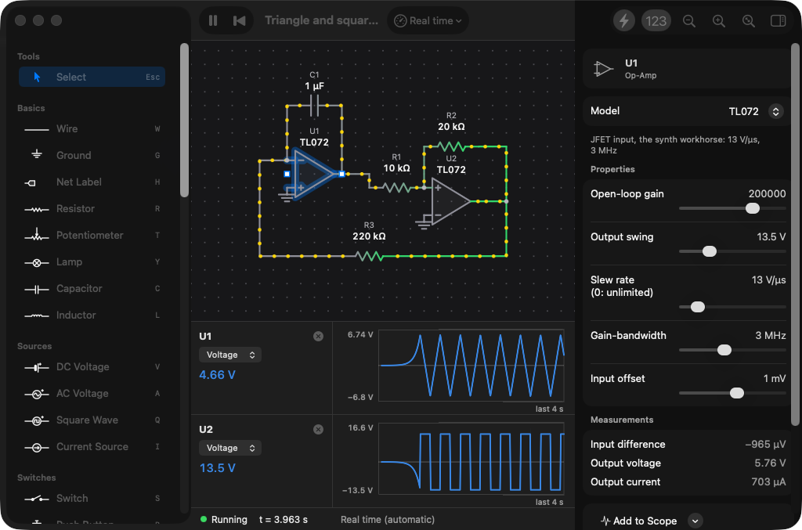
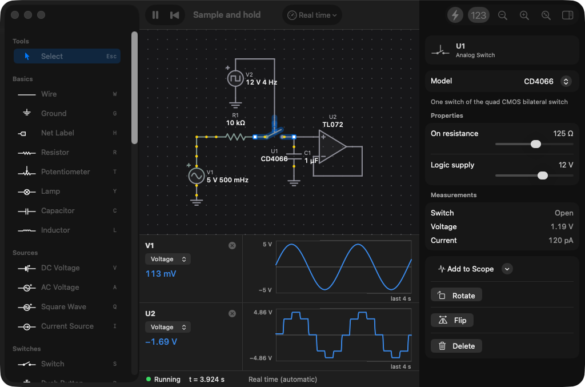
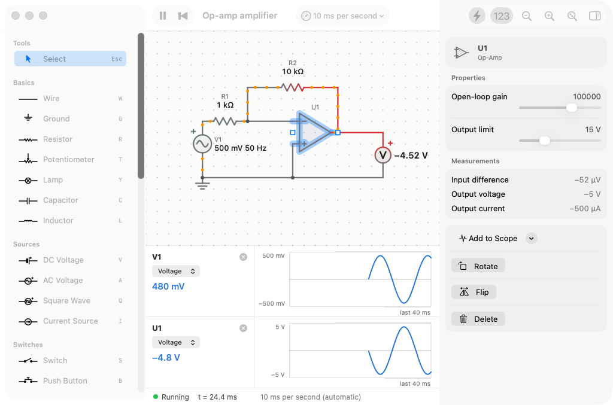
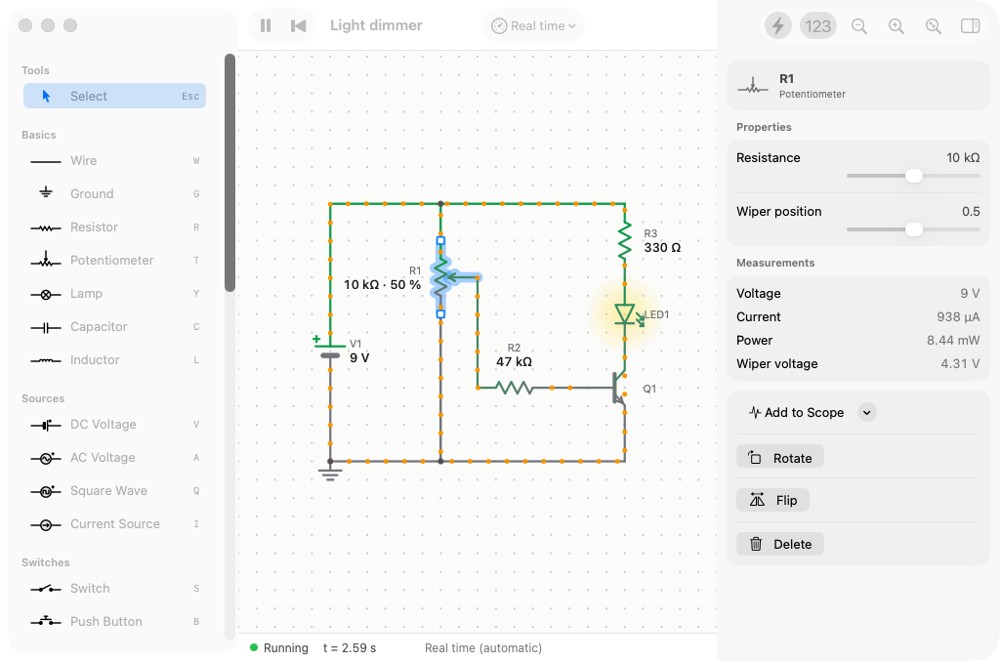

# JSpice for Mac

A native macOS circuit simulator in the spirit of iCircuit and the Falstad applet: draw a circuit and watch it run live, with voltages shown as colour and current as moving dots.



## Features

- **Fast, keyboard-first editing.** Every part has a shortcut (a letter for the common ones, ⇧ and a letter for the rest; they are shown in the library and in Help ▸ Keyboard Shortcuts, ⌘/). ⌘K or / opens a palette: type a part's name, its category or a real part it models ("TL072", "LM13700", "vactrol") and press Return. While placing, a ghost of the part follows the pointer and a pill says what you are placing. Arrow keys nudge the selection (⇧ for five units), ⌘D duplicates it, Tab steps through the parts, and the library can be searched.
- **Draw circuits directly.** Pick a part in the library (or press its key: `R` resistor, `C` capacitor, `W` wire, …), then click to place it or drag to set its length and direction. Parts connect where their ends meet, and a part dropped onto the middle of a wire joins it with a T-junction (wires that merely cross stay apart). Wires stretch when you move the parts they connect.
- **Live simulation.** The circuit simulates while you draw. Voltages are coloured (green positive, red negative, grey at 0 V), current flows as dots, LEDs and lamps glow, and memristors show their internal state.
- **Real time when possible.** Circuits that change slowly enough to watch run in real time (a capacitor charging over a second, a 1 Hz memristor loop). Faster ones run in slow motion automatically, for example a 100 Hz filter at 5 ms per second, and the status bar says so. If a circuit is too heavy to keep up, it runs as fast as it can and the status bar shows how far behind it is. You can also set the speed yourself.
- **Interact while it runs.** Click switches, hold push buttons, scroll over a potentiometer to turn it, and drag sliders in the inspector to change values live.
- **Hear it.** Put a speaker across an output and press **Sound** in the toolbar: the circuit runs in real time, one simulation step per audio sample, on a thread of its own, and you hear it through the Mac's output (with a DC blocker and a soft limit, so a stuck rail is silent and nothing clips harshly). Turn a potentiometer or flip a switch while it plays. The speaker's **full scale** sets the voltage that plays at full volume.
- **Play it.** The **Keyboard Pitch** source puts out 1 V per octave (0 V at C2) and the **Keyboard Gate** source a gate while a key is held. With sound on, play them from the Mac's keyboard (A W S E D F T G Y H U J K O L P ; as in GarageBand; Z and X change octave) or from any MIDI keyboard (notes and pitch bend). The newest key sounds, and the pitch stays on the last note after release; give the pitch some **glide** for portamento. A **step sequencer** (in the inspector when the circuit has a keyboard source) plays them by itself: up to 32 steps of notes or rests at a sixteenth note each, with tempo and gate length; it keeps time with the circuit, so it is exact with sound on and in automated simulations. The **Keyboard VCO** example is a real 1 V/octave oscillator (a PNP exponential converter and an LM13700 triangle core), and **Mono synth** plays its square wave through an LM13700 VCA opened by an attack–release envelope (the gate charges it through a DG411 switch).
- **Front panel.** Below the schematic, the circuit's potentiometers, switches and push buttons appear as hardware controls on a faceplate, like a plugin's interface for testing an audio circuit: knobs to drag (double-click to centre), bat toggles to flip, buttons to hold, LEDs as panel lamps, and a level meter for the speaker that turns red when the sound clips. Double-click a label to rename the part. Toggle it with **Panel** in the toolbar.
- **Scopes** for any part's voltage, current, power or resistance over time, or its current against its voltage (an I–V curve, such as a memristor's pinched hysteresis loop).
- **Blocks: circuits as parts.** Give a circuit a **Port** part (in the library's Blocks section) for each of its inputs and outputs and choose **Circuit ▸ Save as Block** (⇧⌘B). It joins the library's Blocks section, and from there it can be placed in any circuit as one part: a box with the ports as its pins, inputs on the left and outputs on the right (by each port's side, or by where it is drawn). Every copy is a whole circuit of its own, with its own state and its own knobs: they appear in the inspector and on the front panel under the block's name. Blocks can contain blocks. Net labels inside a block stay inside it (only ground is shared), so two copies never join by accident. Right-click a block to open it as a circuit, change it and save it again, then **Update from Library** its copies. A circuit file keeps its blocks in it, so it opens anywhere. The simulation puts each block's parts in its place, so a block behaves exactly as its parts drawn out would.
- **Frequency response, live.** Right-click a part and choose **Add Frequency Response** for a Bode plot of its voltage from 10 Hz to 100 kHz: gain in dB and phase, from the circuit's signal source (or any source you pick), with a readout under the pointer and the peak alongside. It is a small-signal analysis like SPICE's `.ac`, made around the circuit's operating point: a copy of the circuit with the driving source held still settles in the background and follows every change. Turn a filter's cutoff or resonance knob and watch the curve move, or turn a fuzz's bias and watch its gain change.
- **Library of parts:** wire, ground, net label, resistor, potentiometer, lamp, capacitor, inductor, DC/AC/square-wave voltage sources, current source, switch, push button, diode, Zener diode, LED, NPN and PNP transistors, NMOS and PMOS transistors, N-JFET, op-amp, OTA, analog multiplier, 555 timer, Schmitt inverter, analog switch, CMOS logic (gates, D flip-flop, decade and binary counters, analog multiplexers, phase-locked loop), unbuffered CMOS inverter, bucket-brigade delay line, digital echo (PT2399), vactrol, comparator, synth chips (VCO, VCF, ADSR envelope, VCA, sample and hold, clock divider), microcontrollers (ATmega328P / Arduino Uno, ATmega2560 / Arduino Mega, ATtiny85, RP2040 / Raspberry Pi Pico), memristor, voltmeter probe, ammeter, speaker, keyboard pitch and gate, white noise. Transistors, op-amps, OTAs, chips and potentiometers can be flipped as well as rotated.
- **Microcontrollers that run your code.** Put a microcontroller in a circuit, write a sketch as in the Arduino IDE (`setup()`, `loop()`, `pinMode`, `digitalWrite`, `analogRead`, `analogWrite`, `delay`, `millis`, `tone`, `Serial`…) and upload it (⌘U). The sketch is compiled with the board's real compiler and Arduino core, and the chip runs the firmware instruction by instruction. Its pins drive the circuit through their output resistance and read it with real logic thresholds and optional pull-ups (and pull-downs on the Pico).
  - **ATmega328P** (the Arduino Uno's chip, pins D0–D13 and A0–A5 as on the board), **ATmega2560** (the Arduino Mega: D0–D53 and A0–A15, six timers, four serial ports) and **ATtiny85** (PB0–PB5, numbered 0–5 in the sketch; 8 MHz, no serial port): one AVR emulator with each chip's layout, at 16 MHz (8 MHz for the ATtiny85): timers and PWM, the ADC, the USARTs (the first is shown in the inspector's serial monitor), SPI and two-wire (I²C) as masters (on the Uno and the Mega: `SPI` and `Wire` clock their bits out on the pins at the rates they set, and an I²C address is acknowledged only if something in the circuit pulls SDA low), external and pin-change interrupts and EEPROM. It was checked against simavr instruction for instruction over millions of instructions of real sketches on all three chips.
  - **RP2040** (the Raspberry Pi Pico: GP0–GP22 and GP26–GP28, 3.3 V, the LED on GP25): a port of [rp2040js](https://github.com/wokwi/rp2040js) running arduino-pico firmware at 125 MHz: the Cortex-M0+ core, timers and alarms, PWM, the ADC, GPIO interrupts, DMA, the hardware divider and interpolators, SPI and I²C controllers as masters (bit by bit on the pins, like the AVR's), and the USB controller, with a simulated computer at the other end of the cable so `Serial` reaches the serial monitor. PIO state machines (behind `tone()`) run in simulated time at their clock dividers. Checked against rp2040js to the nanosecond on real sketches.
  - **Chip Support** (Circuit menu): installs the compiler and the core the first time, downloaded and checked against their checksums into JSpice's Application Support folder; nothing else to install. For the AVR chips, avr-gcc and the Arduino AVR core from Arduino's package index (about 40 MB); for the Pico, arm-none-eabi-gcc and Earle Philhower's [arduino-pico](https://github.com/earlephilhower/arduino-pico) 6.2.0 from its package index (about 240 MB). An Arduino IDE already on the Mac is used too.
  - Logic parts wired straight to a chip's pins see everything the chip does on them, however fast. The chip logs those pins' changes as it runs: the AVR after each instruction and at each SPI and two-wire event within one, the Pico as its GPIOs change. The simulator plays them into the logic parts in order. An SPI word clocked out at 8 MHz, sixteen bits within one step of the circuit, reaches an MCP4921 DAC bit by bit.
  - The examples come with their firmware built in, so they run without Chip Support.
- **Synth parts with real-part behaviour.** One op-amp symbol, one OTA symbol and so on, with the specific part chosen in the inspector's **Model** menu:
  - Op-amp: Ideal, TL072, LM358, NE5532, LM741 (open-loop gain, output swing, slew rate, gain-bandwidth and input offset, so an LM358 visibly slews where a TL072 does not).
  - OTA: LM13700 or CA3080 (output current I_abc·tanh(V_in / 2V_T), bias pin one or two junctions above V−, output clamps below the supply).
  - Multiplier: AD633 (out = x·y / 10 V, softly limited), for ring modulators and VCAs.
  - Bucket-brigade delay line: MN3207, MN3008, MN3005 (delay = stages / 2·clock, the clock swept by a control voltage), for chorus, flanger and echo.
  - Digital echo: PT2399. The resistance from pin 6 to ground sets the delay, as on the chip: about 11.5 ms per kΩ plus 24 ms, so 31 ms at 600 Ω and 342 ms at 27.6 kΩ, as in its datasheet. Pin 6 is modelled as an internal reference behind about 2.1 kΩ, so a control voltage through a resistor modulates the delay too. The longer the delay, the slower the chip's clock, so its echo gets darker (about 20 kHz of bandwidth at 30 ms, 2.4 kHz at 340 ms) and noisier.
  - Vactrol: VTL5C3, NSL-32 (an LED and an LDR whose resistance follows the light with separate attack and decay times), for lowpass gates, compressors and opto tremolo.
  - Synth chips, each worked out once per step from its inputs (so they cost almost nothing to simulate):
    - VCO: AS3340 (CEM3340): one volt per octave with exact tracking, saw, triangle, pulse (width from ±5 V on PW) or sine, PolyBLEP-smoothed so high notes do not alias.
    - VCF: AS3320 (CEM3320), SSM2044: four-pole 24 dB/octave low-pass with soft saturation, one volt per octave, resonance up to self-oscillation.
    - Envelope: AS3310 (CEM3310): ADSR with gate and retrigger inputs and analog-style exponential curves (attack reaches the peak in the attack time; decay and release go nine tenths of the way in theirs).
    - VCA: SSM2164 (exponential, −33 mV/dB) or linear (unity gain at 5 V).
    - Sample and hold: clocked (samples on each rising edge) or LF398 (tracks while high, holds while low, with droop).
    - Comparator: LM393 (pulled up to 5 V), LM311 (±12 V), with hysteresis.
    - Clock divider: CD4013 (÷2, a sub-oscillator), CD4017 carry out (÷10), CD4040 (÷16), with a reset input.
  - Diodes: 1N4148, 1N4001, 1N34A (germanium), BAT41 (Schottky). Transistors: 2N3904, BC547C, 2N5088, BC108, 2N3906, AC128 (germanium). Potentiometers: linear or audio taper.
  - Unbuffered inverter: one inverter of a CD4069UB or CD4049UB, modelled as its two transistors. Biased by a feedback resistor it is the CMOS amplifier of fuzz pedals and preamps: a gain of about 25 at 9 V, clipping softly at the rails.
  - 555 (NE555, TLC555), Schmitt inverter (one gate of a CD40106 or 74HC14), analog switch (one switch of a CD4066 or DG411), N-JFET (2N5457, J201, 2N3819).
  - CMOS logic, with the supply hidden like the 40106's and set in the inspector:
    - Logic gate: one gate of a CD4093 (Schmitt NAND, for gated oscillators), CD4011 (NAND), CD4001 (NOR), CD4081 (AND), CD4071 (OR), CD4070 (XOR), CD4077 (XNOR), 74HC132, 74HC00 or 74HC86.
    - D flip-flop: one half of a CD4013, with set and reset.
    - Decade counter: CD4017 or 74HC4017, with its ten decoded outputs, clock inhibit and carry out.
    - Binary counter: CD4040 or 74HC4040, twelve stages, counting on the falling edge.
    - Analog multiplexer: CD4051 or 74HC4051 (eight channels).
    - Analog selector: one switch of a CD4053 or 74HC4053 (two channels).
    - SPI DAC: MCP4921 (12 bits). Write 0x3000 plus the code with CS low and OUT goes to VREF × code / 4096. It shifts SDI in on SCK's rising edges and latches the word when CS rises, with LDAC low.
    - Phase-locked loop: CD4046 or 74HC4046. Its VCO runs from fMin to fMax as VCO IN goes from 0 V to the supply. Phase comparator 1 is an XOR. Phase comparator 2 is the edge-triggered phase-frequency detector, driving high or low or letting its output go, so the loop filter holds while the loop is locked.
    - Plain CMOS inputs switch at half the supply, Schmitt inputs at their two thresholds. Outputs drive towards the supply or ground through their output resistance. The multiplexers connect the selected channel through their on resistance.
  - Chips that share supply pins in real life (one gate of a 40106, one OTA of an LM13700) use a hidden supply set in the inspector; the 555 has its own VCC and GND pins.
- **Examples:** LED and switch, voltage divider, capacitor charging, RC low-pass filter, LC oscillator, half-wave rectifier, Zener regulator, light dimmer, blinking LEDs (astable multivibrator), transistor switch, CMOS inverter, op-amp amplifier, triangle and square LFO (two TL072s), OTA VCA (LM13700), 555 LED flasher, Schmitt trigger oscillator (40106), sample and hold (CD4066 and TL072), and to listen to: 555 beeper, Schmitt oscillator tone (turn the pot to change the pitch), OTA tremolo (an LM13700 VCA whose gain a slow LFO sweeps), LM13700 resonant filter (a 12 dB/octave state-variable filter with cutoff and resonance pots, on a square wave), wind (noise through that filter), effects: ring modulator (AD633), BBD chorus (MN3207), Fuzz Face, diode-clipper overdrive, vactrol lowpass gate; and to play: keyboard VCO (1 V/octave), mono synth (VCO, envelope and VCA) a full synth voice (VCO through the resonant filter and a VCA, one envelope opening both), and that voice playing a sequenced bassline; synth chips: a chip synth voice (two AS3340s and a CD4013 sub-oscillator through an AS3320 and a VCA, an AS3310 opening both, playing an arpeggio), random notes (noise through a clocked sample and hold into a VCO), comparator PWM (an LM311 comparing a triangle with a slow sine); CMOS: an 8-step sequencer (a CD4093 clock, a CD4040 counter and a CD4051 picking one of eight knobs for a VCO), a four-step Baby 10 (CD4017), a CMOS drone (CD4093 oscillators, a CD4070 XOR and a CD4013 sub-octave), a PLL octave-up (a CD4046 locked to twice its input through a CD4013), a two-stage CD4049UB fuzz, a PT2399 echo with time and repeats knobs; blocks: one tone stage saved as a block and used twice, each copy with its own knob; Arduino (ATmega328P): blink, PWM fade, knob and LED with serial output, melody on a speaker, a sawtooth arpeggio sent sample by sample to an MCP4921 DAC over SPI and through a filter; Arduino Mega: a bar graph from a pot; ATtiny85: a dimmer and a breathing LED; Raspberry Pi Pico: knob and LED with 12-bit PWM and USB serial, a melody from PIO; memristor hysteresis, memristor programming.
- **A real Mac document app:** one window per circuit, open/save as `.jspice` files, autosave, undo and redo for every edit, copy and paste, export the schematic as PNG or PDF, light and dark mode.













## AI control (MCP)

JSpice comes with an MCP server, so an AI agent such as Claude can design, simulate and measure circuits: a physics harness for analog design. The agent describes a circuit as a netlist (parts, models and the nets their terminals join), and JSpice draws it as a tidy schematic, simulates it and reports waveforms, measurements and frequency responses.

Circuits are drawn the way a person would: the signal flows from left to right with the main path on straight lines, sources on the left, parts to ground hanging below the line with ground symbols, pull-ups standing above it, feedback arching over its op-amp, an oscillator's loop returning along the bottom, supply rails as flags (`+12V`, `VCC`), and real wires routed around the parts, with junction dots and few bends or crossings. **Circuit ▸ Tidy Up** (⌥⌘T, or the `tidy_up` tool) redraws any circuit, hand-drawn ones included, the same way, keeping every connection.

Tools: `list_parts`, `list_examples`, `load_example`, `new_circuit`, `build_circuit` (from a netlist), `add_part`, `add_wire`, `remove_part`, `tidy_up`, `set_parameter`, `set_model`, `set_switch`, `set_sequence` (a step pattern for the keyboard sources), `upload_sketch` (compiles an Arduino sketch into a microcontroller, returning the compiler's errors by line), `read_serial` (what a microcontroller printed, and text to send it), `install_chip_support`, `describe_circuit`, `simulate` (waveforms with min, max, mean, RMS, peak-to-peak and frequency for probes like `V(out)`, `I(R1)`, `V(U1.out)`; it can also play timed notes on the circuit's keyboard sources, such as `[{"at": 0, "note": "C4"}, {"at": 0.5, "off": true}]`), `measure`, `define_block` and `list_blocks` (make a netlist into a block, with `port` parts as its pins, and use it as `{"kind": "block", "block": "name", ...}`, as often as needed), `frequency_response` (gain and phase from a source to a probe, with the peak and the −3 dB points: by default a small-signal analysis around the operating point the circuit settles to, exact and instant; or `"method": "transient"`, which measures each frequency with the source's own amplitude, clipping and all), `save_circuit`, `open_circuit`.

To connect Claude:

1. In JSpice, choose **Circuit ▸ Copy MCP Server Configuration**. It copies something like this:

   ```json
   {
     "mcpServers": {
       "jspice": { "command": "/Applications/JSpice.app/Contents/MacOS/jspice-mcp" }
     }
   }
   ```

2. Claude Desktop: paste it into its configuration file (Settings ▸ Developer ▸ Edit Config) and restart it. Claude Code: `claude mcp add jspice /Applications/JSpice.app/Contents/MacOS/jspice-mcp`.

While JSpice is running with **Circuit ▸ Allow AI Control** on (the default), the agent works on the circuit in the front window: you see each change and can undo it. When JSpice is not running, `jspice-mcp` simulates on its own. `jspice-mcp --headless` always simulates on its own, and `--app` insists on the app.

## Install

Download **JSpice-macOS.zip** from the latest successful run of the [macos workflow](../../../actions/workflows/macos.yml) (under *Artifacts*), unzip it and move JSpice to Applications. It runs on macOS 14 or later, on Apple Silicon and Intel Macs.

The app is signed ad hoc but not notarized by Apple, so the first time macOS will refuse to open it. Either right-click JSpice and choose **Open**, or allow it under **System Settings → Privacy & Security → Open Anyway**. From the terminal you can instead run `xattr -dr com.apple.quarantine /Applications/JSpice.app`.

## Build it yourself

Requires Xcode 15 or later.

```
cd macos
swift test                 # simulation engine tests
./scripts/bundle.sh        # builds build/JSpice.app and build/JSpice-macOS.zip
open build/JSpice.app
```

## Shortcuts

| Key | Action |
| --- | --- |
| letter keys | choose a part (shown next to each part in the library) |
| `Esc` | back to selecting |
| `Space` | run / pause |
| `⌘↩` / `⇧⌘↩` | run or pause / reset |
| `⌘R` | rotate the selection |
| `F` or `⇧⌘R` | flip the selected transistors, op-amps and potentiometers |
| `⇧⌘E` | export the schematic as an image |
| `⌥⌘T` | tidy up: redraw the circuit as a neat schematic |
| `Delete` | delete the selection |
| `⌘C` `⌘X` `⌘V` `⌘A` | copy, cut, paste, select all |
| scroll, `⌘` + scroll, pinch | pan, zoom, zoom |
| `⌥` + drag on empty canvas | pan |
| `⌘=` `⌘-` `⌘0` | zoom in, out, to fit |
| scroll over a potentiometer | turn it |
| right-click a part | add a scope or I–V curve, rotate, flip, delete |
| `H` | net label: labels with the same name are connected; `GND` is ground |

## Limitations

- **Simplified device models.** Junctions have no capacitance, so transistors switch instantly. Bipolar transistors have no Early effect, base resistance or high-level injection. MOSFETs are level 1, and nothing depends on temperature. The cross-check compares JSpice with ngspice running these same equations, which shows the numerical error but not how far the models are from real parts.
- **Transient and small-signal analysis only.** There is no DC sweep or noise analysis. Small-signal analysis linearises around the circuit's present state; for chips, only the audio paths (a filter's input, a VCA's input and control, delay lines, a sample and hold while it tracks) pass small signals, and their control inputs (a filter's cutoff CV, a delay's clock) are held where they are.
- **Microcontrollers.** SPI and I²C work as masters only, with no slave mode. The AVR has no watchdog, sleep modes or analog comparator. The Pico runs one core, and its firmware cannot write to flash (no LittleFS or EEPROM emulation).

## How it works

`Sources/CircuitKit` is the simulation engine, written for live stepping and tested on its own (`swift test`). It uses modified nodal analysis, like JSpice and SPICE:

- Wires and closed switches merge their ends into one node; their currents (for the dots) are recovered afterwards from Kirchhoff's current law.
- Capacitors and inductors use second-order Gear (BDF2) companion models: an LC circuit keeps oscillating at the right frequency, and unlike the trapezoidal rule a sudden step does not make currents ring from one time step to the next.
- Each time step is taken in substeps where it needs them. The local error of every capacitor voltage and inductor current is estimated from the third divided difference of its last four values. Where it would be more than 0.1 % (plus 0.1 mV or 0.1 µA), as at an edge or where a diode turns on, and where Newton-Raphson does not converge, the step is solved again in halves, quarters, down to a 64th. The substeps grow back by doubling where the error allows, and BDF2 takes variable-step coefficients. Where nothing changes quickly a step is a single solve, as before. With sound on, substeps follow only Newton-Raphson's failures, as the sound sets its own step by how fast the computer keeps up.
- Diodes, Zener diodes, LEDs, bipolar transistors (Ebers–Moll), MOSFETs (level 1), op-amps (an internal stage with a single pole at the gain-bandwidth, slew-rate limited, ahead of a smooth output limit), OTAs, JFETs and analog switches are solved with Newton-Raphson and junction voltage limiting at every time step. When a circuit snaps from one state to another, like the two transistors of a flip-flop changing over, Newton is guided to the new solution by gmin stepping: the junctions are briefly shunted and the shunts stepped down to nothing.
- 555 timers, Schmitt inverters and the CMOS logic parts switch between discrete states. A substep in which one switches is solved again with the new state, so timing does not lag by a step. The counters and flip-flops act on their clock's edges as the substeps find them, and a substep that is thrown away takes their state back with it.
- Memristors follow a threshold switching model (on resistance, off resistance, on and off thresholds, switching time) like the MSS models in JSpice.
- With sound on, a copy of the simulator runs on its own thread, four steps per sample at the output's rate (fewer if the circuit is too heavy), filling about 50 ms of sound ahead; the window's simulator takes on its state at each display frame to draw it. Each step is cheap: parameters are read once when the circuit loads, only the parts that need it are visited, and Newton-Raphson reuses its buffers. `jspice-mcp --benchmark` times every example at 48 kHz.
- The engine is checked against ngspice. `tools/spice-reference/crosscheck.py` writes SPICE decks with JSpice's own device equations for fourteen circuits: RC and RLC, a rectifier, a Zener regulator, an LED, a common-emitter amplifier, the astable blinker, a CMOS inverter, a JFET, op-amps, the triangle LFO, and the Fuzz Face and overdrive examples. It runs them with tight tolerances and records the waveforms (`Tests/CircuitKitTests/Fixtures/spice-reference.json`). `SpiceCrossCheckTests` simulates the same circuits at the step JSpice picks and at a tenth of it, and fails beyond 5 % of a waveform's range, or of an oscillator's period and swing. CI prints the table.
- A block part carries its circuit. Before simulating, each copy's parts are put into the circuit after its own parts, moved off to one side of the drawing. Their ids are made from the block's and their own, so state survives edits. Their names are prefixed with the block's ("X1.R2"), and inside net labels get the copy's own names. Each port becomes a wire to its pin. The engine then sees one flat circuit: blocks cost nothing beyond their parts, and a knob inside a block is a parameter change like any other.
- Small-signal (AC) analysis reuses Newton-Raphson's matrix at the present solution: it holds every diode's, transistor's and chip's slope at the operating point. Capacitors and inductors are taken out and put back as jωC and 1/jωL at each frequency. Parts with dynamics of their own are put back as transfer functions: an op-amp's internal pole, an AS3320's four stages with their feedback (each stage's pole set by how far its soft saturation is driven), a delay line's e^(−jωT) and a PT2399's two clock-tracking poles. The complex equations are solved by sparse-aware elimination at every frequency, around 200 frequencies in a few milliseconds for a typical circuit. `crosscheck.py --ac` records ngspice's operating point and `.ac` sweep of nine circuits: RC and RLC, a Zener's ripple, a common-emitter and a JFET stage, a TL072 inverting amplifier out to its bandwidth, a Sallen-Key low-pass, and the Fuzz Face and overdrive examples. `SmallSignalTests` requires JSpice to match within 0.001 dB and 0.01°; it does to better than 0.0001 dB and 0.001°, since the equations are the same and nothing is integrated. The chips ngspice has no model of (the filter, VCA, delay lines and the LM13700 filter) are checked against JSpice's own transient simulation driven with a small sine.
- `Pacing` estimates the circuit's time constants and periods to pick the speed and time step; `Simulator.advance` stops at a per-frame compute budget, so the app stays responsive however heavy the circuit is.

`Sources/JSpiceAutomation` holds the automation tools and the MCP server, `Sources/jspice-mcp` the stdio server, and `Sources/JSpice` the SwiftUI and AppKit app. CI builds it on macOS, runs the engine tests, runs `JSpice --self-test` (which draws a circuit with mouse events, moves, deletes, undoes, joins a part to a wire, turns a potentiometer and flips a switch, and checks the results), and renders screenshots with `JSpice --screenshots`.
